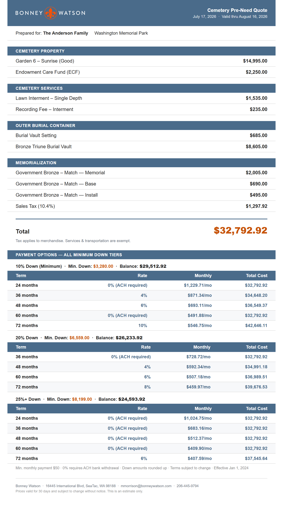
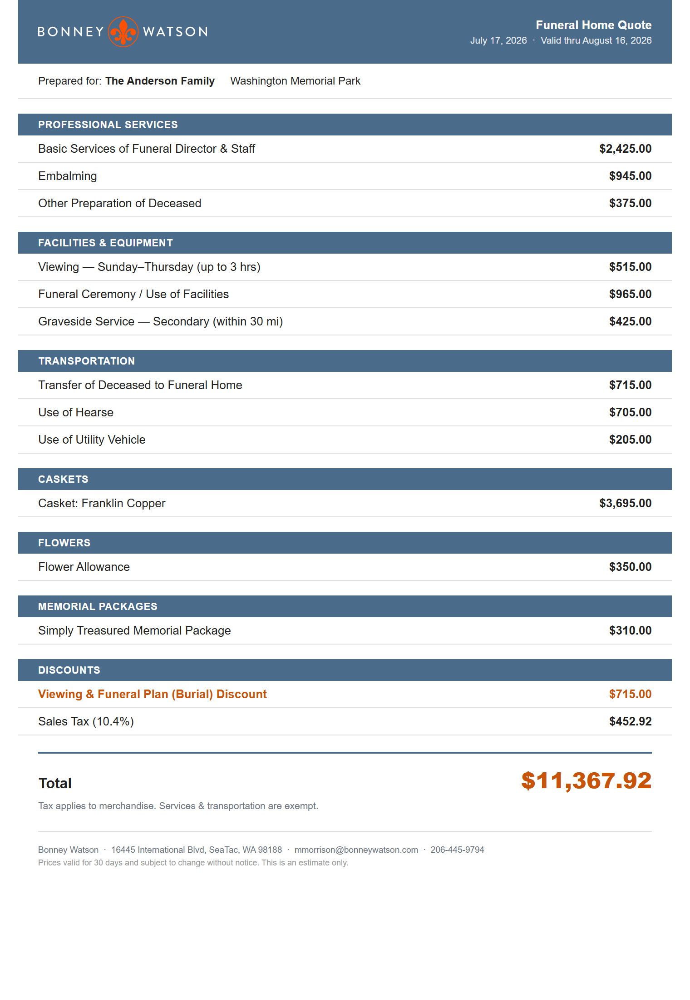
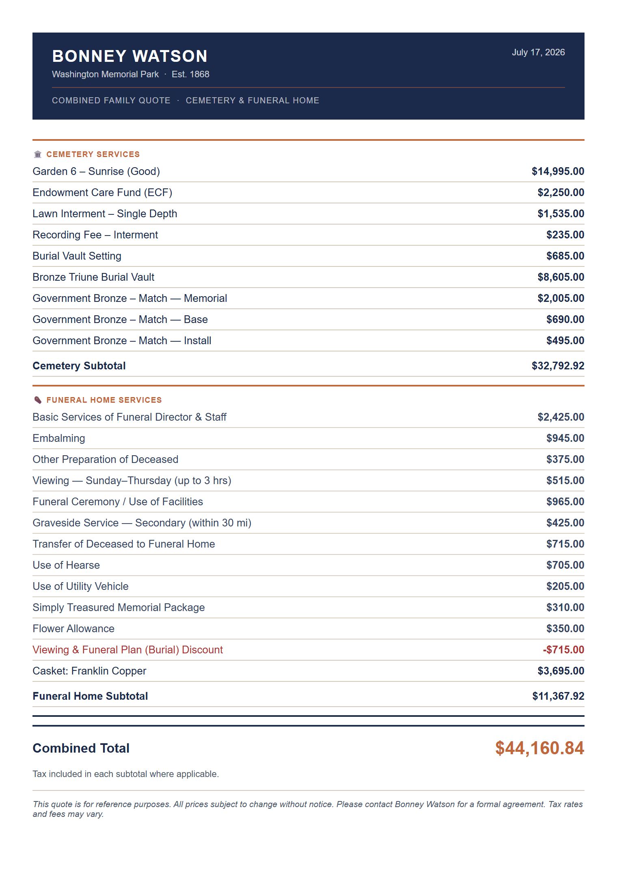
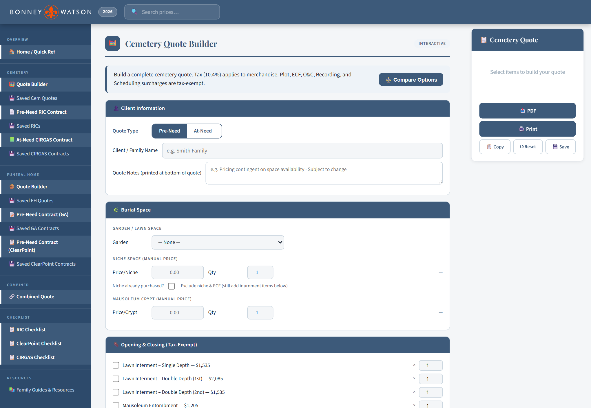
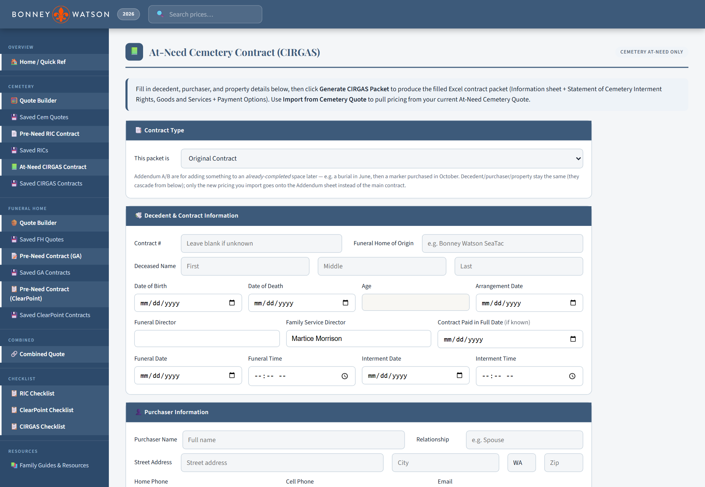

# Design Debrief — Bonney Watson Quote & Contract Tool

**Prepared for:** a Claude design consultation
**Prepared by:** Claude (engineering session), for Martice Morrison
**Date:** July 17, 2026
**Goal of this doc:** give a designer everything needed to propose concrete improvements to (1) the counselor-facing web app and (2) the family-facing quotes. Engineering (me) will implement whatever we land on — so ideas can be ambitious, but they must be buildable within the constraints in the last section.

---

## 1. What this is, in one paragraph

This is an internal web app used by cemetery/funeral **sales counselors** at **Bonney Watson** (a Seattle-area funeral home + cemetery, serving families at Washington Memorial Park). A counselor sits with a grieving family, builds an itemized **price quote** (cemetery property, markers, vaults, services, or funeral-home services), and then generates the **legal contract paperwork** from that quote (retail installment contract "RIC", at-need "CIRGAS" packet, pre-need insurance contracts). The same tool both (a) is the counselor's working surface and (b) produces the documents the **family sees and signs**. So there are really two very different design audiences in one product.

The primary user is **Martice**, a counselor who also builds and maintains the tool. It has grown feature-by-feature over many months and is now quite capable but visually dense.

---

## 2. The two surfaces to design for

### Surface A — the counselor app (internal, on-screen)
- Left **sidebar navigation** grouped into: Overview · Cemetery (Quote Builder, Saved, RIC contract, CIRGAS contract) · Funeral Home (Quote Builder, Saved, GA contract, ClearPoint contract) · Combined · Checklists · Resources.
- The **Quote Builders** are the heart of it: long scrolling forms of collapsible panels — property type, spaces, ECF, opening/closing fees, vaults, markers (granite/bronze/PCM), vases, inscriptions, discounts, payment/financing, notes. A live **running total + summary** updates on the right as items are added.
- The **contract tabs** are similarly dense forms that map quote data onto real templates.
- Used almost entirely on **desktop**, often live in front of a family, so **speed, scannability, and "don't make me hunt"** matter a lot. Mistakes in front of a grieving family are costly.

**Honest state:** it works and Martice is fast in it, but it's visually busy — many panels, checkboxes, emoji-prefixed labels, and inconsistent density. A newcomer would find it overwhelming. Hierarchy, grouping, and progressive disclosure are the likely wins.

### Surface B — the family-facing quote (printed / PDF)
- Generated two ways that must look the same: an on-screen **Print** view (HTML/CSS) and a downloadable **PDF** (drawn with pdf-lib primitives).
- Structure today: brand header (fleur logo + "Cemetery Pre-Need Quote" etc. + date/expiration) → "Prepared for [family name]" row → itemized **line sections** grouped by category (Cemetery Property, Cemetery Services, Outer Burial Container, Memorialization, etc.) → sales tax → **Total** → **Payment Options** (financing tiers: 10%/20%/25% down × terms, with monthly + total cost) → optional notes → footer.
- There is also a separate polished **family guides page** (`guides.html`) — a card grid linking to PDF brochures (Pre-Planning, Burial, Cremation, Marker, Casket, Urn catalogs, maps).

**Honest state:** functional and recently cleaned up so Print and PDF match, but it reads like a **spreadsheet/invoice** — correct and itemized, but not especially warm, and dense for a grieving family to parse. The payment-options block in particular is a wall of numbers.

---

## 2.5 Attached visuals (current state — the "before")

Five real screenshots are attached alongside this debrief in `design-screenshots/`. They are the actual current output, generated today.

**Family-facing quotes (Surface B — the priority):**

`01-family-quote-cemetery.png` — a cemetery pre-need quote. Note the strong navy section bars, the big orange total, and especially the **payment-options block at the bottom: three down-payment tiers, each a full table of term/rate/monthly/total. That's ~14 rows of numbers — the single densest, least-warm moment in the whole document.** This is the #1 thing to rethink.

`02-family-quote-funeral.png` — a funeral-home quote (same visual system as cemetery: logo header, categorized sections, tax, total).

`03-family-quote-combined.png` — a combined cemetery + funeral quote. **Important: this one uses a *different, older* visual language** — a darker solid-navy text header with **no logo**, orange section labels, tighter rows — inconsistent with the other two. Unifying the three quote types under one system is a clear win. (I just fixed a character-encoding bug on this view where em-dashes and emoji were rendering as mojibake; the attached image is the corrected version.)

**Counselor app (Surface A):**

`04-tool-cemetery-builder.png` — the Cemetery Quote Builder: left sidebar + a long column of collapsible panels, with a fixed running-total summary on the right. Representative of the density issue.

`05-tool-cirgas-contract.png` — the At-Need CIRGAS contract tab: a dense multi-panel form (decedent, purchaser, on-contract checkboxes, interment order, signers, etc.). Shows how form-heavy the contract screens get.

---

## 3. Brand & current design system (real values in the code today)

- **Fonts:** `Playfair Display` (serif — headings, the "elegant" voice) + `Source Sans 3` (sans — body/UI).
- **Color tokens currently in the app:**
  - Navy `#3d5a7a` (primary), navy-mid `#2d4a6b`
  - Orange/rust accent `#c8540a`
  - Off-white background `#f4f6f8`, gray-light `#f0f4f8`, gray-mid `#c8d4de`
  - Text `#1a2332`, text-light/muted `#5a6a7a` / `#9aaab8`
  - Green `#2d6a2d` (positive), red `#c0392b` (remove/alert)
- **Logo:** Bonney Watson fleur-de-lis mark + wordmark (navy).
- **Note / open question:** the official BW brand reference (a 2026 GPL brochure) uses a slightly different **navy `#466e86`** and **orange `#e84610`** than the app's `#3d5a7a` / `#c8540a`. Worth deciding whether to unify the app to the official brand values.

**Tone requirement (non-negotiable):** this is end-of-life / at-need work. Everything the family sees must be **dignified, warm, calm, and clear — never salesy, never cold, never "conversion-optimized."** Pricing has to be transparent and easy to understand, but presented with compassion. This is the single most important design constraint.

---

## 4. What we'd love design ideas on

Prioritized, but pick where you can add the most value:

### For the family-facing quote (highest priority)
1. **Make an itemized quote feel humane, not like an invoice.** How should a grieving family read $18,000 of line items without it feeling transactional? Grouping, typography, whitespace, section intros, plain-language labels?
2. **Payment options without a wall of numbers.** Today we show 3 down-payment tiers × several term rows each. Is there a calmer, clearer way to present "here's roughly what this could look like monthly" while keeping the full detail available?
3. **A cover / summary moment.** Should the quote lead with a warm one-line summary and total before the itemization? What belongs "above the fold"?
4. **Print + PDF parity.** Whatever the design, it has to render both as HTML/CSS (print) and via pdf-lib drawing primitives (download). Simpler layouts are easier to keep identical — keep that in mind.

### For the counselor app (secondary but valuable)
5. **Tame the density of the Quote Builders.** Better visual hierarchy, grouping, and progressive disclosure so a long form of panels is scannable at a glance and fast to operate live in front of a family.
6. **A consistent component language.** Panels, rows, checkboxes, price displays, running totals, and the summary sidebar are currently styled ad-hoc. A small, consistent kit would help.
7. **Navigation & orientation.** The sidebar has ~20 items across 6 groups. Is the grouping right? Is there a clearer mental model (e.g. "start a quote → pick contract" flow)?
8. **The emoji question.** Nav and panel headers lean on emoji (🧮 📄 📗 ⚱️). Keep, refine, or replace with a proper icon set?

---

## 5. Constraints the designer must design within

These are hard limits — please design *for* them, not around them:

- **Single-file HTML/JS app, no framework, no build step.** All CSS/JS is inline in one `index.html`, deployed by pushing to GitHub Pages. That's fine for CSS/layout/typography work, but there's no React/Tailwind/component build — components are hand-written HTML + CSS classes.
- **Family quotes render two ways and must match:** on-screen **Print** = HTML/CSS; **download** = a PDF drawn with **pdf-lib** primitives (rectangles, lines, `drawText` at x/y). The PDF path can't use HTML/CSS, so **layouts that lean on simple boxes, rules, type scale, and spacing translate cleanly; anything relying on flexbox/grid/SVG/background-images does not.** Favor designs that degrade to "boxes + text + rules."
- **Desktop-first** for the counselor app (used on a laptop with a family); the family quote must **print cleanly on US Letter** and read well on paper and screen.
- **Brand is fixed:** Bonney Watson fleur logo, Playfair + Source Sans, navy/orange palette (open question above on exact hex).
- **Accessibility & clarity for older adults:** many families and the counselor prefer generous type sizes and high contrast.
- **No dark patterns, no urgency, no upsell framing.** (Restating because it matters.)

---

## 6. What we want back from the consult

- **Concrete, buildable direction** — ideally a short **design language** (type scale, color usage, spacing, a handful of component patterns) plus **1–2 redesigned mockups**: the **family quote** (the priority) and one **Quote Builder** screen.
- **Prioritized recommendations** (biggest impact first), each with a note on effort/complexity so we can sequence.
- Where relevant, **before/after** thinking so Martice can see the rationale.
- Keep in mind the deliverable is guidance for *me* (engineering) to implement in inline HTML/CSS + pdf-lib — so annotate anything that's HTML-only vs. needs to also work in the PDF.

---

## 7. Quick reference — where things live (for whoever implements)

- `index.html` — the entire app (UI + quote builders + contract generators + PDF/print code).
- Family quote **Print** views: `printCemQuote()` / `printFhQuote()` + shared CSS in `_printQuoteCSS()` and header/footer helpers.
- Family quote **PDF**: `_buildQuotePDF()` (pdf-lib) + `downloadCemQuotePDF()` / FH / Combined callers.
- `guides.html` — the family-facing resource/brochure page (a good reference for a warmer, more finished visual direction already in the family voice).
- Live app: `https://marticeisme.github.io/bw-quote-tool/`
- Live guides page: `https://marticeisme.github.io/bw-quote-tool/guides.html`

---

*End of debrief. The engineering session that produced this can answer follow-up questions about current behavior, provide screenshots of any screen, or pull exact current styling for any component.*
